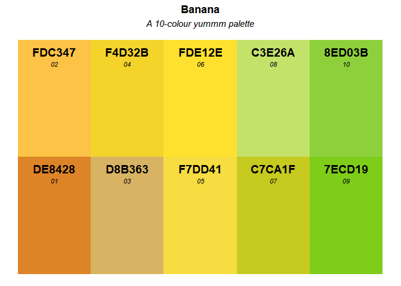

<!-- README.md is generated from README.Rmd. Please edit that file -->

# yummm

## Overview

Delicious colors to decorate your graphics.

## Installation

``` r
devtools::install_github("StefanVriend/yummm")
```

## Usage

``` r
library(yummm)
```

Each food is associated with a 10-color palette. Visualize them using
`yummm_palette`.

``` r
yummm_palette(food = "banana")
```

<!-- -->

Once you have picked your favorite food and shade of color, select them
using `yummm`.

``` r
yummm(food = "banana", shade = "05")
#> [1] "#F7DD41"
```

To finally use them in your graphics:

``` r
# Do not run
library(ggplot2)
ggplot(bpw, aes(x=n)) + 
  geom_histogram(binwidth=1, fill=yummm("banana", "05"), colour="gray70")
```

<!-- -->
