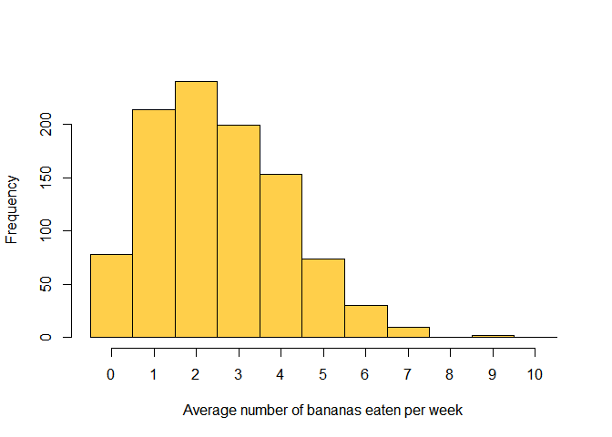

<!-- README.md is generated from README.Rmd. Please edit that file -->
yummm
=====

> Coloring with all delicious food items

Use your favourite food items to colour your graphics and texts.

Installation
------------

``` r
devtools::install_github("StefanVriend/yummm")
```

Usage
-----

``` r
library(yummm)
yummm("banana")
#> [1] "#FFCF4A"
```

``` r
# Do not run
hist(..., col=yummm("banana"))
```


