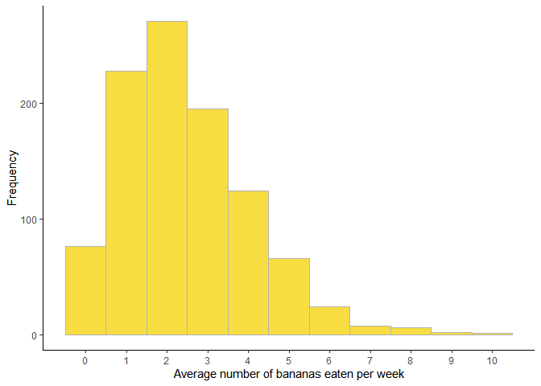

<!-- README.md is generated from README.Rmd. Please edit that file -->

# yummm

## Overview


## Installation

``` r
devtools::install_github("StefanVriend/yummm")
```

## Usage

``` r
library(yummm)
yummm("banana")
#> [1] "#FFCF4A"
```

``` r
# Do not run
library(ggplot2)
ggplot(bpw, aes(x=n)) + 
  geom_histogram(binwidth=1, fill=yummm("banana"), colour="gray70")
```

<!-- -->
